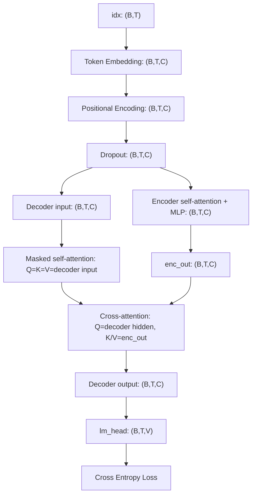

# Issue: 完善 Transformer debug README：补充流程图、模块职责、教学简化说明与练习任务

## 背景

当前仓库中已经新增了 Transformer debug 学习文件：

- `docs/chapter2/code/transformer_debug.py`
- `docs/chapter2/code/README_transformer_debug.md`

`transformer_debug.py` 已经使用较小参数打印 Transformer 前向传播中的关键 tensor shape，并打印 causal mask，便于学习 Multi-Head Attention、Encoder、Decoder、lm_head 等模块的数据流。

当前 `README_transformer_debug.md` 已经具备：

- 运行方式说明；
- 小参数符号约定；
- Embedding、PositionalEncoding、Attention、Encoder、Decoder、lm_head 的 shape 逐步解释；
- causal mask 的基本说明。

但它目前更像一份 “Shape Debug 学习笔记”，还缺少几块内容。如果希望 Codex/学习者后续长期复用，并能用这份 README 给别人讲解 Transformer，需要进一步增强。

## 目标

请完善：

```text
docs/chapter2/code/README_transformer_debug.md
```

不要求大改 `transformer_debug.py`。优先只更新 README。如果发现 README 中需要引用的输出名称与代码打印名称不一致，可以小幅修正 `transformer_debug.py` 的打印标签，但不要改变模型结构和主逻辑。

## 具体任务

### 1. 增加整体数据流图

在 README 中新增一节，例如：

```markdown
## 整体前向传播数据流
```

使用 Mermaid 画出从输入 token id 到 loss 的整体流程。建议覆盖以下链路：

```text
idx: (B, T)
→ Token Embedding: (B, T, C)
→ Positional Encoding: (B, T, C)
→ Dropout: (B, T, C)
→ Encoder: (B, T, C)
→ Decoder: (B, T, C)
→ lm_head: (B, T, V)
→ Cross Entropy Loss
```

同时体现 Decoder 中有两类注意力：

```text
Decoder.mask_self_attention: Q/K/V 都来自 decoder input
Decoder.cross_attention: Q 来自 decoder hidden state，K/V 来自 encoder output
```

建议 Mermaid 示例结构如下，Codex 可以根据 README 现有上下文自行优化：



### 2. 增加模块职责说明

在 README 中新增一节，例如：

```markdown
## 模块职责说明
```

建议用表格说明每个模块的作用。至少覆盖：

| 模块 | 输入 shape | 输出 shape | 作用 |
| --- | --- | --- | --- |
| `Embedding` | `(B, T)` | `(B, T, C)` | 把 token id 查表为 token embedding |
| `PositionalEncoding` | `(B, T, C)` | `(B, T, C)` | 给 token embedding 注入位置信息 |
| `Encoder` | `(B, T, C)` | `(B, T, C)` | 对输入序列进行 self-attention 编码 |
| `Decoder.mask_self_attention` | `(B, T, C)` | `(B, T, C)` | 使用 causal mask，只允许当前位置看见自己和历史 token |
| `Decoder.cross_attention` | Q: `(B,T,C)`, K/V: `(B,T,C)` | `(B,T,C)` | 使用 decoder query 读取 encoder 输出 |
| `MLP` | `(B, T, C)` | `(B, T, C)` | 对每个 token 位置做前馈非线性变换 |
| `lm_head` | `(B, T, C)` | `(B, T, V)` | 把 hidden state 投影到词表空间，得到每个 token 的 logits |

注意：这里的 `C = n_embd = dim = 16`，`V = vocab_size = 32`，应与 README 中已有符号约定保持一致。

### 3. 增加教学简化与不严谨点说明

在 README 中新增一节，例如：

```markdown
## 教学简化与注意事项
```

需要明确提醒：这个 debug 文件适合学习 Transformer 模块拼装和 shape 流动，但不是严格的工业级或论文级训练实现。

至少说明以下几点：

1. 当前实现中 Encoder 和 Decoder 使用的是同一份输入 `x`，没有严格区分 source sequence 和 target sequence。
2. 当前 demo 没有构造标准机器翻译训练中的 shifted target。标准 Encoder-Decoder 训练通常是 Encoder 输入源序列，Decoder 输入右移后的目标序列。
3. 当前 `targets = inputs_id.clone()` 只是为了演示 `lm_head` 和 `cross_entropy loss` 如何跑通，不代表完整语言模型或翻译模型的数据构造方式。
4. `LayerNorm` 是手写教学版本，实际工程中通常直接使用 `torch.nn.LayerNorm`。
5. 当前 MLP 使用 `MLP(args.dim, args.dim, args.dropout)`，中间维度没有放大。标准 Transformer FFN 常见设置是 `dim -> 4 * dim -> dim`，LLaMA 等模型还可能使用 SwiGLU。
6. 当前代码中的 `n_embd` 和 `dim` 设置为相同值 16，这样残差连接 shape 能自然对齐。学习时不建议随意改成不同值，除非同步检查所有残差路径的 shape。

这部分非常重要，避免初学者误以为该 debug 文件就是标准训练代码。

### 4. 增加动手练习任务

在 README 中新增一节，例如：

```markdown
## 建议练习任务
```

请设计 5 个左右可执行的小练习，要求 Codex/学习者可以直接照做。建议包括：

#### 练习 1：修改 head 数

把：

```python
n_heads=4
```

改为：

```python
n_heads=2
```

观察：

- `head_dim` 如何变化；
- `xq split heads` 的 shape 如何变化；
- `scores before mask` 的 shape 如何变化。

#### 练习 2：修改序列长度

把 `block_size` 和 `max_seq_len` 从 8 改成 16，并把手写输入序列扩展到长度 16。观察：

- `PositionalEncoding.pe_slice`；
- `causal_mask`；
- `scores before mask`。

#### 练习 3：观察 causal mask 作用

临时注释掉：

```python
scores = scores + causal_mask
```

对比注释前后 `attention weights` 是否允许当前位置看到未来 token。README 中只需要描述练习方法，不要求真的提交这个破坏性改动。

#### 练习 4：扩大 MLP hidden_dim

把 EncoderLayer 和 DecoderLayer 中的：

```python
MLP(args.dim, args.dim, args.dropout)
```

改为：

```python
MLP(args.dim, 4 * args.dim, args.dropout)
```

观察：

- 参数量变化；
- `Encoder.layer_0.output` 和 `Decoder.layer_0.output` shape 是否仍为 `(B,T,C)`。

#### 练习 5：替换 LayerNorm

把自定义 `LayerNorm` 替换为 `nn.LayerNorm(args.n_embd)`，确认 forward 仍能跑通。说明工程中推荐直接使用 PyTorch 原生 LayerNorm。

### 5. 增加最终学习检查问题

在 README 末尾新增一节，例如：

```markdown
## 学完后应能回答的问题
```

建议列出以下问题：

1. 为什么 Q/K/V 要通过不同线性层生成？
2. 为什么 Multi-Head Attention 要把 `(B,T,C)` 拆成 `(B,H,T,D)`？
3. 为什么 attention score 的 shape 是 `(B,H,T,T)`？
4. `causal_mask` 为什么是右上角为 `-inf` 的上三角矩阵？
5. Encoder self-attention 和 Decoder masked self-attention 的区别是什么？
6. Decoder cross-attention 中 Q、K、V 分别来自哪里？
7. 为什么 `merged heads` 会从 `(B,H,T,D)` 回到 `(B,T,C)`？
8. 为什么 `lm_head` 的输出是 `(B,T,V)`？
9. 训练阶段为什么可以用 `logits.view(-1, V)` 和 `targets.view(-1)` 计算交叉熵？
10. 这个 debug 实现和标准 Encoder-Decoder Transformer 训练代码有哪些区别？

## 验收标准

完成后应满足：

- [ ] `docs/chapter2/code/README_transformer_debug.md` 增加整体数据流图。
- [ ] README 增加模块职责说明表。
- [ ] README 明确说明当前代码的教学简化和不严谨点。
- [ ] README 增加 5 个左右可操作练习任务。
- [ ] README 增加“学完后应能回答的问题”。
- [ ] 原有运行方式、符号约定、Shape 逐步解释保留，不要删除。
- [ ] `python docs/chapter2/code/transformer_debug.py` 仍可正常运行。
- [ ] 如果修改了 `transformer_debug.py`，必须保证模型结构和前向主逻辑不发生破坏性变化。

## 建议执行方式

1. 先阅读：

```text
docs/chapter2/code/transformer_debug.py
docs/chapter2/code/README_transformer_debug.md
```

2. 只更新 README，除非发现打印标签与 README 明显不一致。
3. 更新后运行：

```bash
python docs/chapter2/code/transformer_debug.py
```

4. 检查 README 中所有 shape 是否与代码输出一致。
5. 提交 commit，commit message 建议：

```text
docs: improve transformer debug README
```

## 非目标

本 issue 不要求：

- 重写 Transformer 模型结构；
- 实现完整机器翻译训练；
- 引入新的第三方依赖；
- 把该 debug 文件改成工业级训练框架；
- 大幅修改 chapter2 正文。
