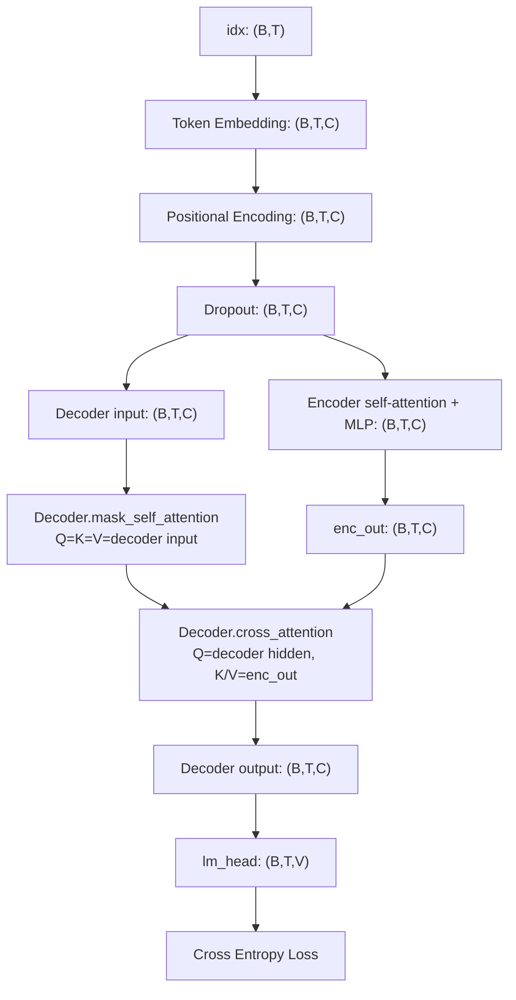

# Transformer Debug Shape 学习笔记

这个文件配合 `transformer_debug.py` 阅读。debug 版本使用很小的参数，并在前向传播时打印关键 tensor 的 shape 和 causal mask，方便跟踪 Transformer 中每一步的数据流。

## 运行方式

```bash
cd docs/chapter2/code
python transformer_debug.py
```

脚本不依赖 `BertTokenizer.from_pretrained()`，不会联网下载模型。输入是手写的两个 token 序列。

## 符号约定

- `B = batch_size = 2`，一次输入 2 条样本。
- `T = sequence_length = 8`，每条样本有 8 个 token。
- `C = n_embd = dim = 16`，每个 token 的隐藏向量维度是 16。
- `H = n_heads = 4`，多头注意力有 4 个头。
- `D = head_dim = C / H = 4`，每个注意力头处理 4 维向量。
- `V = vocab_size = 32`，小词表大小是 32。

## 整体前向传播数据流

下面的图展示了 `transformer_debug.py` 中一次 forward 从 token id 到 loss 的整体路径。这个 debug 版本同时保留了 Encoder 和 Decoder，Decoder 内部先做 masked self-attention，再用 cross-attention 读取 Encoder 输出。



`Decoder.mask_self_attention` 的 Q、K、V 都来自 Decoder 当前输入，并且会加上 causal mask。`Decoder.cross_attention` 的 Q 来自 Decoder hidden state，K 和 V 来自 Encoder 输出 `enc_out`。

## 模块职责说明

| 模块 | 输入 shape | 输出 shape | 作用 |
| --- | --- | --- | --- |
| `Embedding` | `(B, T)` | `(B, T, C)` | 把 token id 查表为 token embedding。 |
| `PositionalEncoding` | `(B, T, C)` | `(B, T, C)` | 给 token embedding 注入位置信息。 |
| `Encoder` | `(B, T, C)` | `(B, T, C)` | 对输入序列进行 self-attention 编码。 |
| `Decoder.mask_self_attention` | `(B, T, C)` | `(B, T, C)` | 使用 causal mask，只允许当前位置看见自己和历史 token。 |
| `Decoder.cross_attention` | Q: `(B, T, C)`, K/V: `(B, T, C)` | `(B, T, C)` | 使用 decoder query 读取 encoder 输出。 |
| `MLP` | `(B, T, C)` | `(B, T, C)` | 对每个 token 位置做前馈非线性变换。 |
| `lm_head` | `(B, T, C)` | `(B, T, V)` | 把 hidden state 投影到词表空间，得到每个 token 的 logits。 |

## Shape 逐步解释

`Embedding.idx` 的 shape 是 `(B, T)`，表示输入 token id。每个位置是一个整数，用来索引词表中的 token。

`Embedding.tok_emb` 的 shape 是 `(B, T, C)`。Embedding 层把每个 token id 查表成一个长度为 `C` 的向量，所以最后多出隐藏维度。

`PositionalEncoding.pe_slice` 的 shape 是 `(1, T, C)`。第一个维度为 1，可以广播到整个 batch；它给每个时间位置提供一个固定的位置向量。

`PositionalEncoding.output` 仍是 `(B, T, C)`。位置编码和 token embedding 相加，只改变向量内容，不改变 shape。

Attention 中的 `xq/xk/xv after wq/wk/wv` 是 `(B, T, C)`。线性层把输入 hidden state 投影成 Query、Key、Value。

`xq/xk/xv split heads` 是 `(B, T, H, D)`，表示把 16 维向量拆成 4 个头，每个头 4 维。

`xq/xk/xv transposed` 是 `(B, H, T, D)`。注意力计算希望每个头独立计算，所以把 head 维度提前。

`scores before mask` 是 `(B, H, T, T)`。每个 query 位置都要和所有 key 位置做一次相似度计算，所以最后两个维度是 `T x T`。

Decoder 的 `causal_mask` 是 `(1, 1, T, T)`，会广播到 `(B, H, T, T)`。二维视图中，对角线和左下角是 `0`，右上角是 `-inf`。第 `i` 个 token 只能看见自己和之前的 token，不能看见未来 token。

`attention weights` 仍是 `(B, H, T, T)`。softmax 后，每一行表示某个 query 位置对所有 key 位置的注意力分布。

`weighted value` 是 `(B, H, T, D)`。注意力权重乘以 Value 后，每个头得到自己的输出向量。

`merged heads` 是 `(B, T, C)`。多个头的结果被拼回隐藏维度。

Encoder 和 Decoder 的输入、每层输出、最终 norm 输出都是 `(B, T, C)`。它们在每个 token 位置上更新 hidden state，但保持 batch、序列长度和隐藏维度不变。

`lm_head.input` 是 `(B, T, C)`，表示 Decoder 输出的 hidden state。

`lm_head.logits` 是 `(B, T, V)`。`lm_head` 把每个 token 位置的 16 维 hidden state 投影到 32 个词表分数，用于预测下一个 token 或计算交叉熵 loss。

训练阶段的 loss 使用 `logits.view(-1, V)` 和 `targets.view(-1)` 计算。这样会把 `(B, T, V)` 展平成 `(B*T, V)`，把 `(B, T)` 展平成 `(B*T)`，相当于把 batch 内所有 token 位置都当成分类样本。

## 教学简化与注意事项

这个 debug 文件适合学习 Transformer 模块拼装和 shape 流动，但不是严格的工业级或论文级训练实现。阅读时需要注意下面这些简化。

1. 当前实现中 Encoder 和 Decoder 使用的是同一份输入 `x`，没有严格区分 source sequence 和 target sequence。
2. 当前 demo 没有构造标准机器翻译训练中的 shifted target。标准 Encoder-Decoder 训练通常是 Encoder 输入源序列，Decoder 输入右移后的目标序列。
3. 当前 `targets = inputs_id.clone()` 只是为了演示 `lm_head` 和 `cross_entropy loss` 如何跑通，不代表完整语言模型或翻译模型的数据构造方式。
4. `LayerNorm` 是手写教学版本，实际工程中通常直接使用 `torch.nn.LayerNorm`。
5. 当前 MLP 使用 `MLP(args.dim, args.dim, args.dropout)`，中间维度没有放大。标准 Transformer FFN 常见设置是 `dim -> 4 * dim -> dim`，LLaMA 等模型还可能使用 SwiGLU。
6. 当前代码中的 `n_embd` 和 `dim` 设置为相同值 16，这样残差连接 shape 能自然对齐。学习时不建议随意改成不同值，除非同步检查所有残差路径的 shape。

## 建议练习任务

### 练习 1：修改 head 数

把：

```python
n_heads=4
```

改为：

```python
n_heads=2
```

观察 `head_dim` 如何变化，`xq split heads` 的 shape 如何变化，以及 `scores before mask` 的 shape 如何变化。

### 练习 2：修改序列长度

把 `block_size` 和 `max_seq_len` 从 8 改成 16，并把手写输入序列扩展到长度 16。重点观察 `PositionalEncoding.pe_slice`、`causal_mask` 和 `scores before mask`。

### 练习 3：观察 causal mask 作用

临时注释掉：

```python
scores = scores + causal_mask
```

对比注释前后 `attention weights` 是否允许当前位置看到未来 token。这个练习只是为了观察 mask 的效果，完成后应恢复原代码。

### 练习 4：扩大 MLP hidden_dim

把 EncoderLayer 和 DecoderLayer 中的：

```python
MLP(args.dim, args.dim, args.dropout)
```

改为：

```python
MLP(args.dim, 4 * args.dim, args.dropout)
```

观察参数量变化，并确认 `Encoder.layer_0.output` 和 `Decoder.layer_0.output` 的 shape 是否仍为 `(B, T, C)`。

### 练习 5：替换 LayerNorm

把自定义 `LayerNorm` 替换为 `nn.LayerNorm(args.n_embd)`，确认 forward 仍能跑通。工程代码中通常推荐直接使用 PyTorch 原生 LayerNorm。

## 学完后应能回答的问题

1. 为什么 Q/K/V 要通过不同线性层生成？
2. 为什么 Multi-Head Attention 要把 `(B, T, C)` 拆成 `(B, H, T, D)`？
3. 为什么 attention score 的 shape 是 `(B, H, T, T)`？
4. `causal_mask` 为什么是右上角为 `-inf` 的上三角矩阵？
5. Encoder self-attention 和 Decoder masked self-attention 的区别是什么？
6. Decoder cross-attention 中 Q、K、V 分别来自哪里？
7. 为什么 `merged heads` 会从 `(B, H, T, D)` 回到 `(B, T, C)`？
8. 为什么 `lm_head` 的输出是 `(B, T, V)`？
9. 训练阶段为什么可以用 `logits.view(-1, V)` 和 `targets.view(-1)` 计算交叉熵？
10. 这个 debug 实现和标准 Encoder-Decoder Transformer 训练代码有哪些区别？
